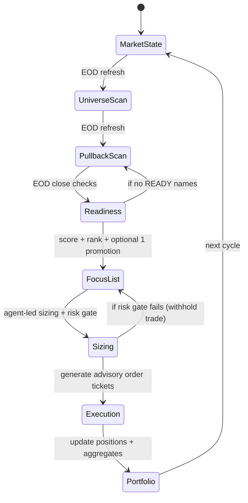

# agent_skeleton.md (FROZEN v1.0)

Version: v1.0
Frozen: 2026-01-17 (UTC)

This file is a frozen snapshot.

---

# Trading Agent Constitution — Rules (v1.0)
_Last frozen: 2026-01-17 (UTC)_

## Changelog
- **2026-01-17 — v1.0**: Initial frozen contract split into Rules / Tasks / UI Contract. Added state-machine diagram for end-to-end flow.

---

# 0. Global Invariants (Never violate)

1. **Market-first:** No market confirmation → no portfolio risk.
2. **Long-only:** **Never short.**
3. **No rotation trades in downtrends:** Stay focused on liquid growth leaders; do not rotate into defensive/energy/etc.
4. **Daily timeframe only:** All decisions anchored to **daily closes** (intraday is execution-only).
5. **No breakout chasing:** Entries are pullbacks into **21EMA structure** or reclaims near structure.
6. **Structure overrides narrative:** Price/structure > news/sentiment/indicators.
7. **EOD discipline:** Stops and readiness are evaluated on **daily close**, with a single override: **max pain**.
8. **Risk is defined before entry:** Every trade has SSL and max loss defined pre-trade.
9. **Adds are new trades:** Any add must have its own setup, risk and stop (no blind scaling).
10. **Earnings constraint:** No positions initiated if earnings < 7 days away.

---

# 1. Market State Labels (Locked)

## 1.1 State: EARLY CONFIRMATION (Test Turn)
**UI label (short):**
```
Current State: EARLY CONFIRMATION (Test Turn)
```

**Meaning:**
- MCO recently ≤ −1σ → washout / fear condition present
- MCSI has stopped falling and is curling up
- Participation improving but **NOT confirmed**
- Market near / reclaiming 21DMA structure

**Permissions:**
- New Entries: **LIMITED** (test only)
- Adds: **NO**
- Pressing: **NO**
- Trims: **YES**

**Hard prohibitions:**
- No full-size entries
- No adds / pyramids
- No “pressing” exposure

---

# 2. Structure Definition (Locked)

## 2.1 21EMA Structure Cloud
Structure is composed of:
- **MAHigh** = 21EMA(high)
- **MAClose** = 21EMA(close)
- **MALow** = 21EMA(low)

## 2.2 Trend & Bar Color Logic (from your script)
- **Bullish (black)** bar: `close > MAHigh AND close > MAClose AND close > MALow`
- **Bearish (pink)** bar: if enabled `useHighBelowCondition`, then `high < MALow` else `close < MALow AND close < MAClose AND close < MAHigh`
- **Neutral** bar: memory/gray

Daily defaults:
- `dailyLength = 21`
- `dailyType = EMA`
Weekly confluence (optional in playbook):
- `weeklyLength = 10`
- `weeklyType = SMA`

---

# 3. Entry Modes (Locked)

## Mode 1 — Weakness into Structure
- Buy on weakness **into** 21EMA structure zone.
- Best R/R, lower confirmation.

## Mode 2 — Reclaim & Backtest / Confirmation
**Definition (locked):**
> Price reclaims the 21DMA-structure, then pulls back for a clean retest that forms a structure higher low.

Higher confirmation, slightly worse R/R vs Mode 1.

---

# 4. Stop & Exit Rules (Locked)

## 4.1 Structural Stop (SSL)
- SSL is the **MALow (21EMA low band)**.
- **Stop trigger:** daily close below SSL.

## 4.2 Exit timing
- If daily close < SSL → **exit the same day at the close**.

## 4.3 Max pain override (hard)
- If max acceptable loss is reached intraday → **exit immediately** (do not wait for close).

---

# 5. Profit-Taking Rules (Locked)

## 5.1 Trim rule
- At **2R**, sell **1/3** of the position.
- Remaining **2/3** is the runner.

## 5.2 Runner rule
- Runner is held until the daily structure breaks:
  - daily close below **MALow (SSL)** → exit at close (same day)

---

# 6. Risk & Sizing (Locked)

## 6.1 Risk per trade (NER)
- **Mode 1:** 0.25% NER
- **Mode 2:** 0.50% NER

## 6.2 Default position size (agent-led)
- **Mode 1:** 10–12% of equity limit
- **Mode 2:** 12–15% of equity limit

Position size is expressed as:
- `Position Size $ = Equity Limit × Position %`

---

# 7. Focus List Manual Promotion (Locked)

Ranking is rules-based, with **one manual promotion allowed**.

**Manual promotion constraint (strict):**
- Only allowed reason: **Best reclaim & backtest quality**
- Must come from the same pullback candidate set
- If no clear qualifier → no promotion


---

# Trading Agent Constitution — Tasks (v1.0)
_Last frozen: 2026-01-17 (UTC)_

## Changelog
- **2026-01-17 — v1.0**: Initial frozen contract split into Rules / Tasks / UI Contract. Added state-machine diagram.

---

# State Machine (End-to-End Flow)



---

# TASK 1 — Market Analysis (QQQE + Breadth)

## Agent Steps
### 1.1 Market (QQQE)
1) Load QQQE daily data + 21EMA structure (MAHigh/MAClose/MALow)
2) Determine:
   - price vs structure (above / inside / below cloud)
   - structure slope (rising / flat / falling)

### 1.2 Breadth (Nasdaq100 MCO/MCSI)
3) Read MCO z-score and MCSI z-score (Nasdaq100)
4) Detect:
   - MCSI slope (curling up/down)
   - MCSI vs 10DMA (above/below)
5) Emit the **Market State label** (e.g., EARLY CONFIRMATION)

## Output (agent payload)
```yaml
task: market_state
market: QQQE
breadth_universe: Nasdaq100
qqqe_structure_position: inside_cloud
qqqe_structure_slope: rising
mco_z: -0.69
mcsi_z: -0.38
mcsi_slope: curling_up
mcsi_vs_10dma: below
state: EARLY_CONFIRMATION
```

---

# TASK 2 — Liquid Leaders Universe Scan (EOD)

## Agent Steps
1) Run the Liquid Leaders universe scan (locked filters)
2) Output 30–40 leaders (example: 44)
3) Store as `universe_liquid_leaders` for downstream tasks

## Output
```yaml
task: universe_scan
refresh: EOD
count: 30-40
tickers: [ ... ]
```

---

# TASK 3 — Liquid Leaders 21DMA Pullback Scan (EOD)

## Agent Steps
1) Apply pullback scan filters to Task 2 universe
2) Output 5–10 pullback candidates
3) Store as `pullback_candidates`

## Output
```yaml
task: pullback_scan
refresh: EOD
count: 5-10
tickers: [ ... ]
```

---

# TASK 4 — Entry Readiness (Daily Close Only)

## Agent Steps
1) For each pullback candidate:
   - evaluate daily close only
   - confirm within ATR bounds and structure intact
2) Mark as READY or NOT READY
3) Assign entry mode (Mode 1 or Mode 2)

## Output
```yaml
task: readiness
rows:
  - ticker: QBTS
    ready: true
    mode: MODE2
    dist_to_21ema_atr: 0.2
```

---

# TASK 5 — Focus List Ranking (Top 5)

## Agent Steps
1) Score candidates using locked ranking inputs
2) Produce Top 5
3) Optional: apply **1 manual promotion** ONLY for:
   - Best reclaim & backtest quality

## Output
```yaml
task: focus_list
top5: [ ... ]
manual_promotion:
  used: true|false
  ticker: TICKER|null
  reason: best_reclaim_backtest_quality|null
```

---

# TASK 6 — Position Sizing & Risk Gate (Agent-led)

## Agent Steps
1) For each READY focus name:
   - apply default position % by mode
   - compute $ position, shares, SSL, R/share, 2R
   - compute EC risk %
2) Apply risk gate:
   - if regime forbids new entries → WITHHOLD
   - if NER per trade exceeds allowed → WITHHOLD
   - if earnings < 7 days → WITHHOLD

## Output
```yaml
task: sizing
ticker: QBTS
mode: MODE2
position_percent: 12
position_dollars: 12000
entry: 28.84
ssl: 26.76
shares: 416
r_per_share: 2.08
trim_2r_price: 33.00
ec_risk_percent: -0.86
gate: PASS|WITHHOLD
```

---

# TASK 7 — Execution Instructions (Advisory Tickets)

## Agent Steps
1) If Task 6 gate == PASS:
   - emit entry instructions
   - emit 2R trim (1/3) instructions
   - encode stop rule (close < SSL → exit at close)

## Output
```yaml
task: execution_plan
ticker: QBTS
entry:
  order_type: MARKET
  shares: 416
  tif: DAY
profit:
  trim_2r:
    shares: 139
    price: 33.00
stop:
  ssl: 26.76
  rule: "daily close < ssl -> exit at close (same day)"
```

---

# TASK 8 — Portfolio (Create / Update / Display)

## Agent Steps
1) Ingest current positions + trades (last 24h)
2) Update per position:
   - SSL
   - trimmed %
   - secured P&L
   - open heat
3) Compute portfolio aggregates:
   - gross exposure
   - NER
   - open heat
   - secured profits
4) Render Portfolio table + summary tiles

## Output
```yaml
task: portfolio
summary:
  gross_exposure: 114
  ner: 1.24
  open_heat: 13.96
  secured_profits: 0.22
positions:
  - ticker: QBTS
    weight: 11.2
    entry: 28.84
    ssl: 27.19
    trimmed: 0
```

---

# TASK 9 — Overview Navigation + Trades Today

## Agent Steps
1) Render nav using cached outputs for each task
2) Trades Today = fills last 24h rendered in trade ticket format

## Output
```yaml
task: overview
nav: [Market State, Liquid Leaders, Pullback Scan, Focus List, Trades Today, Portfolio]
trades_today:
  - time_utc: "15:52"
    action: "BUY"
    ticker: "QBTS"
    shares: 416
    price: 28.84
```


---

# Trading Agent Constitution — UI Contract (v1.0)
_Last frozen: 2026-01-17 (UTC)_

## Changelog
- **2026-01-17 — v1.0**: Initial UI contract. Standardized panel layout and output formats for each task.

---

# UI Navigation (Top Level)

```
Market State | Liquid Leaders | Pullback Scan | Focus List | Trades Today | Portfolio
```

Each tab renders the **latest cached output** of its corresponding task.

---

# Panel 1 — Market State

### Always-visible header
```
Current State: EARLY CONFIRMATION (Test Turn)
```

### Compact metrics table
| Metric | Value |
|---|---:|
| QQQE vs 21EMA structure | Inside cloud |
| 21EMA structure slope | Rising |
| MCO (z) | -0.69 |
| MCSI (z) | -0.38 |
| MCSI trend | Curling up (below 10dma) |

### Permissions strip
```
New Entries: LIMITED | Adds: NO | Pressing: NO | Trims: YES
```

---

# Panel 2 — Liquid Leaders (Universe)

### Output
- Show ticker list (30–40)
- Optional: small cards (ticker + bar color + dist to structure)

---

# Panel 3 — Pullback Scan (5–10)

### Output
- Show ticker list (5–10)
- Optional: small “near-structure” badges:
  - `-0.5..+1.0 ATR from 21EMA`

---

# Panel 4 — Focus List (Top 5) + Readiness Table

### Focus list chips
```
QBTS*  RDDT  ALAB  CVNA  VRT
* Manual promotion: Best reclaim & backtest quality
```

### Readiness table (monochrome)
| Rank | Ticker | Mode | READY (EOD) | Dist→21EMA (ATR) | Earnings (d) | Reclaim/Backtest |
|---:|---|---:|---|---:|---:|---|
| 1 | QBTS* | 2 | ✅ | +0.2 | 10 | A |
| 2 | RDDT | 2 | ✅ | +0.4 | 14 | B |

---

# Panel 5 — Trades Today (last 24h)

| Time (UTC) | Action | Ticker | Shares | Price | Notes |
|---|---|---|---:|---:|---|
| 15:52 | BUY | QBTS | 416 | 28.84 | Mode 2, READY (EOD) |
| 15:52 | SELL (1/3) | QBTS | 139 | 33.00 | 2R Trim |
| 15:55 | BUY | ALAB | 58 | 171.85 | Mode 1, READY (EOD) |

---

# Panel 6 — Portfolio

### Summary tiles
```
Gross Exposure: 114%     New Exposure Risk (NER): 1.24%
Open Heat: +13.96%       Secured Profits: +0.22%
```

### Portfolio table
| Ticker | Side | Weight | Entry | SSL (21EMA low) | Trimmed | Secured P&L | Open Heat | Total R | EC % |
|---|---|---:|---:|---:|---:|---:|---:|---:|---:|
| QBTS | Long | 11.2% | 28.84 | 27.19 | 0% | -0.64% | -0.70% | 0.1 | 0.06% |
| ALAB | Long | 8.3% | 171.85 | 162.18 | 0% | -0.44% | -0.90% | 0.9 | 0.46% |
