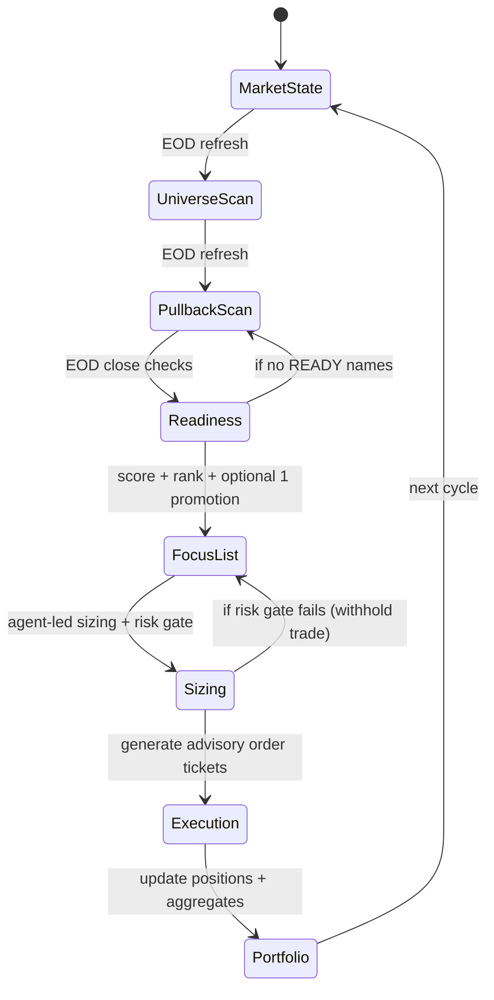

# Trading Agent Constitution — Tasks (v1.0)
_Last frozen: 2026-01-17 (UTC)_

## Changelog
- **2026-01-17 — v1.0**: Initial frozen contract split into Rules / Tasks / UI Contract. Added state-machine diagram.

---

# State Machine (End-to-End Flow)



---

# TASK 1 — Market Analysis (QQQE + Breadth)

## Agent Steps
### 1.1 Market (QQQE)
1) Load QQQE daily data + 21EMA structure (MAHigh/MAClose/MALow)
2) Determine:
   - price vs structure (above / inside / below cloud)
   - structure slope (rising / flat / falling)

### 1.2 Breadth (Nasdaq100 MCO/MCSI)
3) Read MCO z-score and MCSI z-score (Nasdaq100)
4) Detect:
   - MCSI slope (curling up/down)
   - MCSI vs 10DMA (above/below)
5) Emit the **Market State label** (e.g., EARLY CONFIRMATION)

## Output (agent payload)
```yaml
task: market_state
market: QQQE
breadth_universe: Nasdaq100
qqqe_structure_position: inside_cloud
qqqe_structure_slope: rising
mco_z: -0.69
mcsi_z: -0.38
mcsi_slope: curling_up
mcsi_vs_10dma: below
state: EARLY_CONFIRMATION
```

---

# TASK 2 — Liquid Leaders Universe Scan (EOD)

## Agent Steps
1) Run the Liquid Leaders universe scan (locked filters)
2) Output 30–40 leaders (example: 44)
3) Store as `universe_liquid_leaders` for downstream tasks

## Output
```yaml
task: universe_scan
refresh: EOD
count: 30-40
tickers: [ ... ]
```

---

# TASK 3 — Liquid Leaders 21DMA Pullback Scan (EOD)

## Agent Steps
1) Apply pullback scan filters to Task 2 universe
2) Output 5–10 pullback candidates
3) Store as `pullback_candidates`

## Output
```yaml
task: pullback_scan
refresh: EOD
count: 5-10
tickers: [ ... ]
```

---

# TASK 4 — Entry Readiness (Daily Close Only)

## Agent Steps
1) For each pullback candidate:
   - evaluate daily close only
   - confirm within ATR bounds and structure intact
2) Mark as READY or NOT READY
3) Assign entry mode (Mode 1 or Mode 2)

## Output
```yaml
task: readiness
rows:
  - ticker: QBTS
    ready: true
    mode: MODE2
    dist_to_21ema_atr: 0.2
```

---

# TASK 5 — Focus List Ranking (Top 5)

## Agent Steps
1) Score candidates using locked ranking inputs
2) Produce Top 5
3) Optional: apply **1 manual promotion** ONLY for:
   - Best reclaim & backtest quality

## Output
```yaml
task: focus_list
top5: [ ... ]
manual_promotion:
  used: true|false
  ticker: TICKER|null
  reason: best_reclaim_backtest_quality|null
```

---

# TASK 6 — Position Sizing & Risk Gate (Agent-led)

## Agent Steps
1) For each READY focus name:
   - apply default position % by mode
   - compute $ position, shares, SSL, R/share, 2R
   - compute EC risk %
2) Apply risk gate:
   - if regime forbids new entries → WITHHOLD
   - if NER per trade exceeds allowed → WITHHOLD
   - if earnings < 7 days → WITHHOLD

## Output
```yaml
task: sizing
ticker: QBTS
mode: MODE2
position_percent: 12
position_dollars: 12000
entry: 28.84
ssl: 26.76
shares: 416
r_per_share: 2.08
trim_2r_price: 33.00
ec_risk_percent: -0.86
gate: PASS|WITHHOLD
```

---

# TASK 7 — Execution Instructions (Advisory Tickets)

## Agent Steps
1) If Task 6 gate == PASS:
   - emit entry instructions
   - emit 2R trim (1/3) instructions
   - encode stop rule (close < SSL → exit at close)

## Output
```yaml
task: execution_plan
ticker: QBTS
entry:
  order_type: MARKET
  shares: 416
  tif: DAY
profit:
  trim_2r:
    shares: 139
    price: 33.00
stop:
  ssl: 26.76
  rule: "daily close < ssl -> exit at close (same day)"
```

---

# TASK 8 — Portfolio (Create / Update / Display)

## Agent Steps
1) Ingest current positions + trades (last 24h)
2) Update per position:
   - SSL
   - trimmed %
   - secured P&L
   - open heat
3) Compute portfolio aggregates:
   - gross exposure
   - NER
   - open heat
   - secured profits
4) Render Portfolio table + summary tiles

## Output
```yaml
task: portfolio
summary:
  gross_exposure: 114
  ner: 1.24
  open_heat: 13.96
  secured_profits: 0.22
positions:
  - ticker: QBTS
    weight: 11.2
    entry: 28.84
    ssl: 27.19
    trimmed: 0
```

---

# TASK 9 — Overview Navigation + Trades Today

## Agent Steps
1) Render nav using cached outputs for each task
2) Trades Today = fills last 24h rendered in trade ticket format

## Output
```yaml
task: overview
nav: [Market State, Liquid Leaders, Pullback Scan, Focus List, Trades Today, Portfolio]
trades_today:
  - time_utc: "15:52"
    action: "BUY"
    ticker: "QBTS"
    shares: 416
    price: 28.84
```
